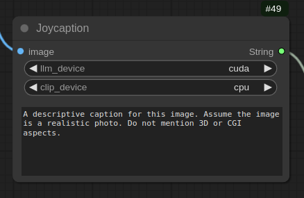

# Joycaption for ComfyUI
Integration of joycaption model for better tagging of images. Use in combination with models which support rich text encoders like Flux or SDXL. 

Credits to the model all going to https://huggingface.co/spaces/fancyfeast/joy-caption-pre-alpha

## Nodes
This documentation provides an overview of Joycaption node. 

### Joycaption
In order to get Joycaption to work, you need to handle the following models:
- a LLM (in this case LLaMa 3.1 8B instruction model quantized to int4), approx. 6GB VRAM
- a CLIP model (google/siglip-so400m-patch14-384), which is used to encode the images
- the image adapter model, which can be found at the link above

For low VRAM environments (< 12 GB), it is recommended to shift the clip model to the cpu. However, this will slow down the process significantly.
**Parameters**
- `image`: The input images which should be tagged. 
- `llm_device`: The device to use for the LLM model ('cuda' or 'cpu').
- `clip_device`: The device to use for the CLIP model ('cuda' or 'cpu').
- `instruction`: The instruction to use for the LLM model.